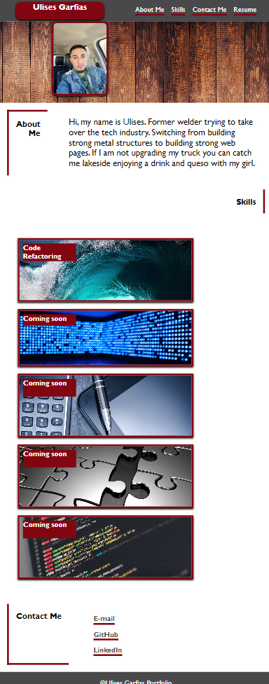
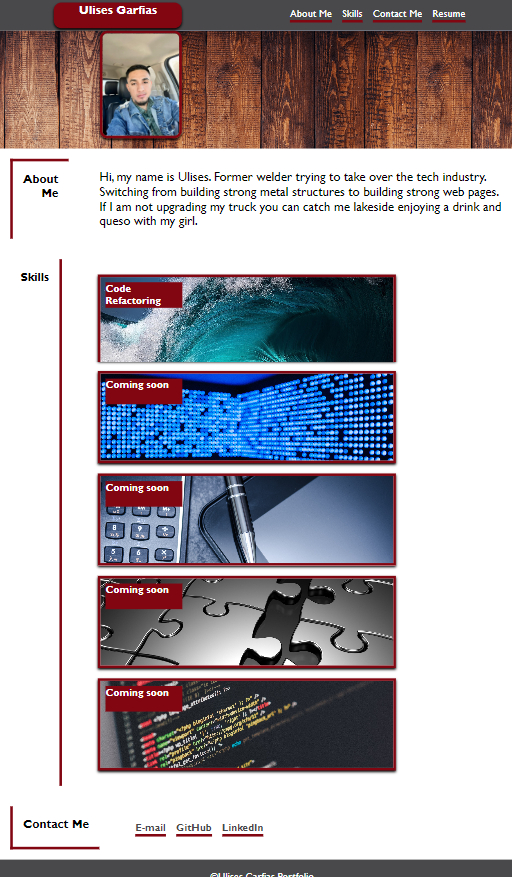
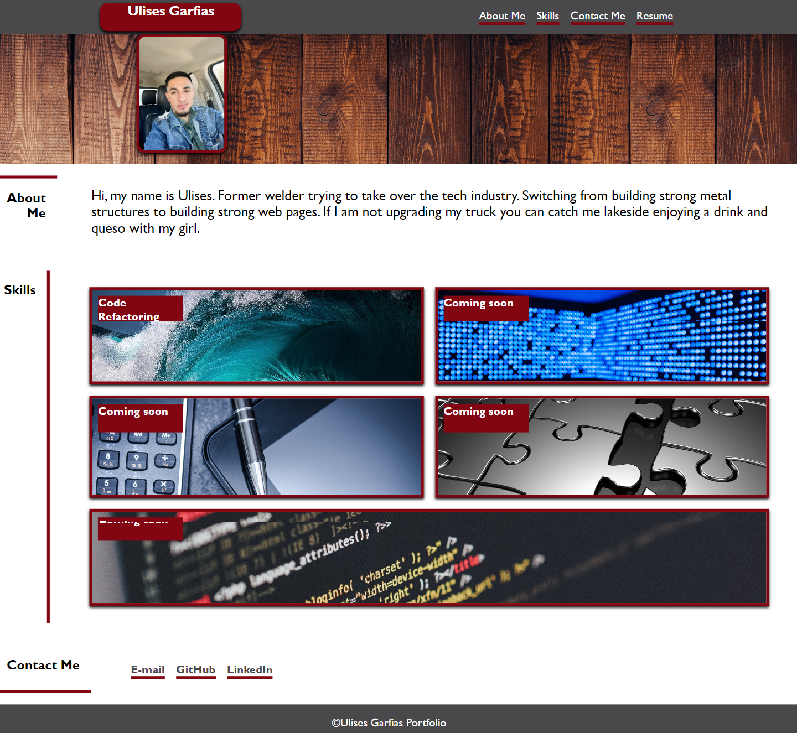

# PROFESSIONAL PORTFOLIO

# PROFESIONAL PORTFOLIO: ULISES GARFIAS
## Description

This portfolio was built to show potential employers some of the developer's work learned throughout the bootcamp so the strongest skills can be highlighted to help the developer achieve his career goals and contribute to the tech industry.

URL: https://garfias06.github.io/professional-portfolio/

## Usage
- The following link images attached to this section show different displays of the screen when it goes full screen and when the screen is reduced to 768px.

- When any of the options displayed on the navigation bar is clicked is gonna take the user to a certain section so the topic can be readable without scrolling down.

- On the "Skills" section the user can click on different images which are shortcuts to past projects created by the author of this portfolio.

## Credits
- Color Pallete:
https://coolors.co/fffffa-515052-616062-6f6e70-7c7b7d-888789-939294-9d9c9e-a6a5a7-aeadaf
- Tutorials:
https://www.youtube.com/watch?v=fgZGqN3AUMY
- Reset CSS Sheet:
https://www.joshwcomeau.com/css/custom-css-reset/
-  Downloaded images:
https://www.wallpaperflare.com/
https://www.superiorwallpapers.com/
https://wallpapercave.com/
https://wallpaperaccess.com/

## License
MIT License

Copyright (c) 2023 Ulises Garfias

Permission is hereby granted, free of charge, to any person obtaining a copy
of this software and associated documentation files (the "Software"), to deal
in the Software without restriction, including without limitation the rights
to use, copy, modify, merge, publish, distribute, sublicense, and/or sell
copies of the Software, and to permit persons to whom the Software is
furnished to do so, subject to the following conditions:

The above copyright notice and this permission notice shall be included in all
copies or substantial portions of the Software.

THE SOFTWARE IS PROVIDED "AS IS", WITHOUT WARRANTY OF ANY KIND, EXPRESS OR
IMPLIED, INCLUDING BUT NOT LIMITED TO THE WARRANTIES OF MERCHANTABILITY,
FITNESS FOR A PARTICULAR PURPOSE AND NONINFRINGEMENT. IN NO EVENT SHALL THE
AUTHORS OR COPYRIGHT HOLDERS BE LIABLE FOR ANY CLAIM, DAMAGES OR OTHER
LIABILITY, WHETHER IN AN ACTION OF CONTRACT, TORT OR OTHERWISE, ARISING FROM,
OUT OF OR IN CONNECTION WITH THE SOFTWARE OR THE USE OR OTHER DEALINGS IN THE
SOFTWARE.

